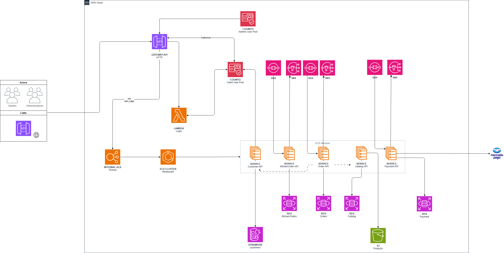

## Como se guiar para usar os módulos

1. Entenda a topologia: abra `src/main.tf` para ver quais módulos são instanciados e como eles estão conectados. Cada módulo em `modules/` representa uma responsabilidade (rede, compute, storage, etc.).
2. Leia o README do módulo (se existir): verifique `modules/<nome>/README.md` para detalhes específicos de entradas (`variables.tf`), saídas (`outputs.tf`) e comportamento.
3. Verifique variáveis e valores: abra `src/variables.tf` e `values.tfvars` (ou o arquivo que vocês usam) para confirmar valores e sensíveis que devem ser passados via environment/CI.
4. Teste localmente: na pasta `src` rode `terraform init`, `terraform plan -var-file="values.tfvars"` e revise o plano antes de aplicar.
5. Isolamento por ambiente: use `terraform workspace` ou backends separados (S3/DynamoDB) para isolar estados entre `dev/staging/prod`.


## Boas práticas para esta implementação

- Modularize com cuidado: cada módulo deve ter responsabilidade única e expor apenas as variáveis estritamente necessárias.
- Controle de versão: trate mudanças de módulo com versão ou tags (se forem módulos remotos). Para módulos locais, mantenha histórico Git e crie releases quando mudar APIs públicas do módulo.
- Evite hardcode: nomes, ARNs e credenciais sensíveis devem vir por variáveis/Secret Manager.
- Backends remotos e locking: configure um backend remoto (S3 + DynamoDB lock) para equipes.
- Revisão de plano: sempre revisar o output de `terraform plan` antes de `apply`.
- Testes e validação: use `terraform validate`, `terraform fmt`, e, se possível, testes automatizados (Terratest) para mudanças críticas.
- Least privilege: defina políticas IAM mínimas necessárias para recursos e para os pipelines/serviços que executam ações.
- Tags e naming: padronize tags e convenções de nome para facilitar cobranças e gerenciamento.
- Proteções: use `lifecycle { prevent_destroy = true }` em recursos críticos quando aplicável e políticas de retenção em buckets que guardam logs/dumps.
- Monitoramento: garanta CloudWatch/Alarms para serviços (ECS, RDS, Lambda).
- Custo: documente os recursos que geram custo (RDS, ALB, NAT gateway) e use limites/alarms.


## Como alterar um módulo com segurança

1. Crie uma branch Git e documente a mudança no PR.
2. Atualize `modules/<nome>/` alterando `main.tf`, `variables.tf` e `outputs.tf` conforme necessário. Mantenha compatibilidade retroativa quando possível.
3. Adicione/atualize `modules/<nome>/README.md` explicando as entradas/saídas e comportamento.
4. Teste localmente: na raiz `src/` execute `terraform init` (ou `terraform init -upgrade` se mudou providers/modules), `terraform plan -var-file="values.tfvars"` e revise alterações.
5. Se a mudança for breaking (mudar nomes de recursos/outputs), planeje uma migração de estado ou crie novos recursos e desative os antigos gradualmente.
6. Use `terraform state mv`/`import` quando necessário para migrar recursos existentes a novos nomes.


## Onde encontrar documentação dos módulos e dos recursos

- Documentação local: verifique `modules/<nome>/README.md` (se presente). Esse arquivo deve ser a primeira fonte de verdade para como o módulo é usado.
- Código do módulo: os arquivos `main.tf`, `variables.tf`, `outputs.tf` do módulo descrevem o comportamento e recursos criados.
- Providers e recursos: para detalhes sobre cada recurso AWS, consulte a documentação oficial do Terraform AWS Provider (ex.: `https://registry.terraform.io/providers/hashicorp/aws/latest/docs`).
- Padrões internos: procure por comentários e exemplos no repositório (ex.: `modules/*/README.md`) e use issues/PRs para esclarecer dúvidas.


## Integrando uma nova API usando ECS + ALB + API Gateway

Resumo do fluxo: você cria/atualiza a Task Definition e o Service do ECS, registra o serviço em um Target Group do ALB e expõe rota no API Gateway que faz proxy para o ALB (HTTP integration) ou, para integração privada, utilize NLB + VPC Link.

Passos práticos (alto nível):

1. Empacote e envie a imagem do container para um registry (ECR, Docker Hub, GHCR) via CI.
2. Crie um novo módulo (por exemplo `modules/my-api/`) ou estenda `modules/ECS-Service` para adicionar:
   - `aws_ecs_task_definition` com o container e variáveis de ambiente.
   - `aws_ecs_service` ligado ao `aws_lb_target_group` (ALB).
   - `aws_lb_target_group` e `aws_lb_target_group_attachment` (ou use o módulo ALB existente para criar/atualizar target group e listener rule).
3. No ALB: adicionar `aws_lb_listener_rule` que encaminhe requisições para o novo target group com base em path/host.
4. No API Gateway:
   - Se o ALB for público: crie uma rota/integration que faça proxy HTTP ao `https://{alb_dns}/{path}` (API Gateway v2 HTTP API ou v1 REST API com HTTP integration).
   - Se quiser privacidade: prefira NLB + VPC Link; crie NLB (Network LB) apontando para seus targets, crie `aws_apigatewayv2_vpc_link` e use integração privada.
5. Atualize `src/main.tf` (ou `API-Gateway-Routes`) para incluir a rota e configurar autorizações (CORS, auth via Cognito) se necessário.
6. Defina outputs: `api_endpoint`, `service_name`, `target_group_arn` para uso por outras stacks.

Exemplo de fluxo de comandos (PowerShell):

```powershell
Set-Location -Path "C:\Users\mateu\GolandProjects\infra-core\src"
terraform init
terraform plan -var-file="values.tfvars"
terraform apply -var-file="values.tfvars"
```

Observações práticas:
- Se preferir usá-lo internamente (sem expor ALB publicamente), crie NLB e use VPC Link no API Gateway. O API Gateway só suporta VPC Link com NLB (Network LB), não diretamente com ALB como integração privada.
- Mantenha health checks corretos no target group para garantir que o ALB envie tráfego apenas para tasks saudáveis.
- Automatize deploys de nova imagem com atualização da task definition e `force_new_deployment` no `aws_ecs_service`.


## Integrando uma nova API usando Lambda + API Gateway

Resumo do fluxo: crie a função Lambda, dê a permissão para o API Gateway invocá-la e crie a rota de API Gateway com integração Lambda (proxy) – essa é a integração mais direta e comum para funções serverless.

Passos práticos (alto nível):

1. Empacote a função Lambda (zip) ou configure CI para fazer o deploy (ex.: publicar para S3 e referenciar `filename`/`s3_key` no Terraform ou usar `image_uri` para Lambda com container).
2. Crie/atualize `modules/Lambda` para incluir a função, role e policies necessárias, e versões/aliases para deploy seguro.
3. No API Gateway:
   - Configure uma integração Lambda (proxy) para a rota desejada.
   - Crie `aws_lambda_permission` para permitir que o API Gateway invoque a função.
4. Atualize `src/main.tf` (ou `API-Gateway-Routes`) para adicionar a rota, mapeamentos e autorizações (CORS, Cognito) se necessário.
5. Defina outputs: `lambda_function_arn`, `lambda_invoke_url` (se aplicável) e `api_route`.

Exemplo de snippet (conceitual) para API Gateway invocar Lambda via Terraform:

```hcl
# aws_lambda_function + aws_apigatewayv2_integration + aws_apigatewayv2_route
resource "aws_lambda_function" "example" {
  # ...package, handler, runtime, role, environment
}

resource "aws_apigatewayv2_integration" "lambda_integration" {
  api_id = aws_apigatewayv2_api.api.id
  integration_type = "AWS_PROXY"
  integration_uri  = aws_lambda_function.example.invoke_arn
}

resource "aws_apigatewayv2_route" "route" {
  api_id = aws_apigatewayv2_api.api.id
  route_key = "GET /my-lambda"
  target = "integrations/${aws_apigatewayv2_integration.lambda_integration.id}"
}

resource "aws_lambda_permission" "apigw" {
  statement_id  = "AllowAPIGatewayInvoke"
  action        = "lambda:InvokeFunction"
  function_name = aws_lambda_function.example.function_name
  principal     = "apigateway.amazonaws.com"
  source_arn    = "${aws_apigatewayv2_api.api.execution_arn}/*/*"
}
```

## Estrutura criada para o projeto

O projeto em questão utiliza dos módulos construidos neste respositório e realiza a implantação da estrutura disposta na imagem:



**Recursos Terraform Criados**

- **VPC**: VPC, subnets, route tables, Internet Gateway, NAT Gateway e Security Groups para isolamento e roteamento da rede.
- **ALB**: Application Load Balancer (aws_lb), listeners, target groups e listener rules para rotear tráfego para serviços.
- **API-Gateway / API-Gateway-Routes**: APIs (AWS API Gateway v2/v1), rotas, integrações, stages e, se aplicável, VPC Link para integração privada.
- **ECS-Cluster / ECS-Service**: ECS Cluster, Task Definitions, ECS Services, Target Groups/attachments e configurações de auto-scaling e logs (CloudWatch).
- **Lambda**: Funções Lambda, roles/policies IAM, versões/aliases e permissões para invocação pelo API Gateway ou outros serviços.
- **RDS**: Instâncias/Clusters RDS, subnet groups e configurações associadas (parameter groups, security groups).
- **Dynamo**: Tabelas DynamoDB para armazenamento NoSQL e índices secundários quando necessários.
- **S3**: Buckets S3 para artefatos, armazenamentos e logs, com políticas e regras de ciclo de vida.
- **SQS**: Filas SQS para enfileiramento assíncrono de mensagens.
- **Cognito**: User Pools / Identity Pools do Cognito para autenticação e autorização de APIs/usuários.
- **SM**: Secrets Manager para armazenar segredos e credenciais de forma segura.
- **APP-Registry**: Recursos relacionados ao registro de aplicações e repositórios de artefatos (ex.: AppRegistry, ECR), conforme implementado no módulo correspondente.
- **Configuração raiz (`src`)**: Providers, backend, variáveis e outputs que orquestram e conectam os módulos acima.

Para detalhes e nomes exatos dos recursos criados, consulte os README específicos em cada pasta de módulo dentro de `modules/`.

### Implantação do projeto

Para a implantação do projeto, em conjunto aos microserviços, siga os passos abaixo:
1. Execute o pipeline de implantação: [Deploy Infra](./pipelines/deploy-infra.yml) para provisionar a infraestrutura necessária.
2. Após a implantação da infraestrutura, execute o pipeline de implantação da function de auth contida em [Deploy Auth Function](https://github.com/FIAP-11soat-grupo-21/app-function-auth).
3. Em seguida, execute o pipeline de implantação do microserviço em cada um de seus respectivos repositórios:
   - [Deploy Customer](https://github.com/FIAP-11soat-grupo-21/api-microservice-customer)
   - [Deploy Order](https://github.com/FIAP-11soat-grupo-21/api-microservice-orders)
   - [Deploy Catalog](https://github.com/FIAP-11soat-grupo-21/api-microservice-catalog)
   - [Deploy Payment](https://github.com/FIAP-11soat-grupo-21/api-microservice-payment)
   - [Deploy kitchenOrder](https://github.com/FIAP-11soat-grupo-21/api-microservice-kitchen-order)
4. Após esses passos, a infraestrutura e os microserviços estarão implantados e prontos para uso.

### Validação de cobertura de teste
Para validar a cobertura de testes utilizamos os sonnarqube:
- https://sonarcloud.io/project/overview?id=FIAP-11soat-grupo-21_api-microservice-catalog
- https://sonarcloud.io/project/overview?id=FIAP-11soat-grupo-21_api-microservice-customer
- https://sonarcloud.io/project/overview?id=FIAP-11soat-grupo-21_api-microservice-kitchen-order
- https://sonarcloud.io/project/overview?id=FIAP-11soat-grupo-21_api-microservice-orders
- https://sonarcloud.io/project/overview?id=FIAP-11soat-grupo-21_api-microservice-payment